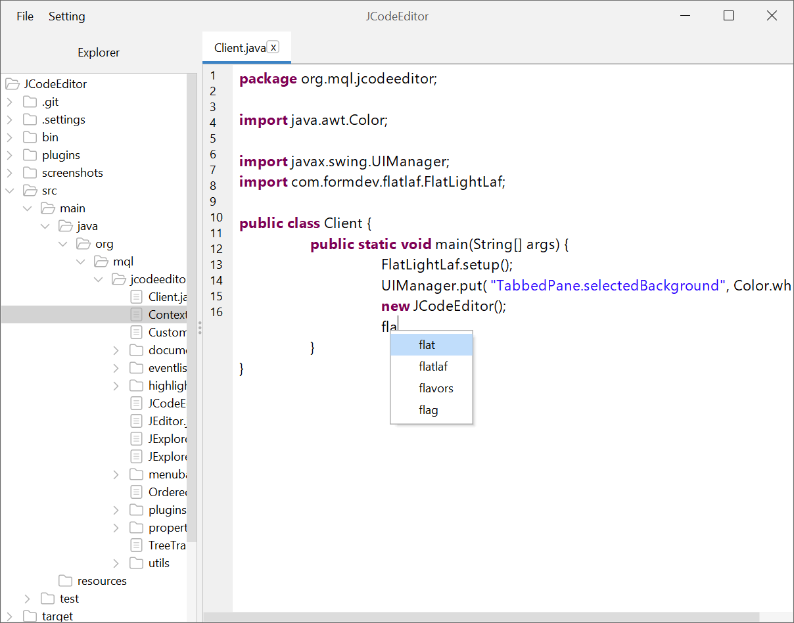

# Autocompletion Plugin

The **Autocompletion Plugin** is an extension for the [JCodeEditor](https://github.com/laktam/JCodeEditor) project, providing auto-suggestion capabilities based on the current text in the editor. It listens to user typing events and offers suggestions for word completions.

## Features

- **Real-time Autocompletion**: The plugin provides word suggestions based on the current document content as the user types.
- **Word Insertion**: The plugin captures all words in the documents from the explorer and stores them in a trie structure.
- **Popup Menu**: A popup menu appears with the word suggestions when a user types a character that can be autocompleted, users can navigate through the suggestion list using arrow keys and select the desired completion by pressing `Enter`.

## How It Works

1. **Document Processing**: The plugin monitors every `JTextPane` in the JCodeEditor and listens for typing events. Each word in the document is captured and stored in a prefix tree (trie) for efficient lookups.
2. **Suggestions Menu**: When a user types, the plugin checks the current word prefix and shows a list of possible suggestions based on previous words found in the document.
3. **Keyboard Navigation**: The suggestions menu supports keyboard navigation, allowing users to move through suggestions with arrow keys and select the desired word with the `Enter` key.
4. **Dynamic Insertion**: Suggestions are updated dynamically as the user types or deletes characters.

## Installation

1. Clone or download this repository.
2. Add the `Autocompletion Plugin` to the `plugins` folder of the JCodeEditor project.

## Example

